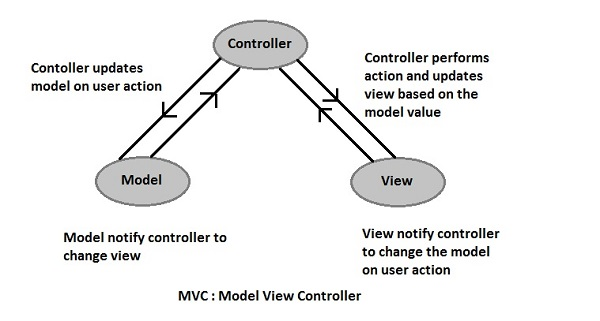

# Frontend System Design

- **Escalabilidade**
  - **Modularidade**: divisão de um sistema em partes menores (módulos), que podem ser desenvolvidos, testados, depurados e atualizados de forma independente, facilitando a manutenção e compreensão do código e permitindo a reutilização dos módulos em diferentes partes do aplicativo ou em outros projetos
  - **Componentização:** encapsular partes de uma interface de usuário em componentes independentes e reutilizáveis. Cada componentes é responsável por uma parte específica da interface e pode ser combinado com outros para criar interfaces complexas.
  - **Performance:** otimizar o tempo de carregamento e responsividade do aplicativo
    - Lazy loading: carregar recursos sob demanda apenas, diminui o tempo de carregamento inicial
    - Otimização de assets: comprimir imagens, minificar css e javascrips, usar CDNs para entregar conteúdo mais rapidamente.
      - Redes de Distribuição de Conteúdo (CDNs): sistemas de servidores distribuídos que trabalham em conjunto para entregar conteúdo da web. Quando um usuário acessa um site, em vez de todos os dados serem enviados do servidor principal do site, que pode estar fisicamente distante do usuário, uma CDN entrega o conteúdo de um servidor mais próximo ao usuário. Isso diminui a latência, que é o tempo que leva para os dados viajarem da origem ao destino, e melhora a velocidade de carregamento do site.
- **Arquitetura**
  - Considerar
    - **Facilidade de manutenção**: bem documentado, com padrões de codificação consistentes e estrutura clara.
    - **Escalabilidade**: capacidade do sistema de lidar com o crescimento, seja em termos de usuários, tráfego ou dados. Considerar como o sistema se comportará sob carga e como pode ser expandido sem uma reformulação completa.
    - **Reusabilidade dos componentes**: componentes genéricos e flexíveis para serem utilizados em diferentes contextos.
    - **Integração com outros sistemas**: como o frontend se integrará com outros sistemas, como backend, APIs, serviços de terceiros e bancos de dados. Definição de interfaces clara e a utilização de padrões de comunicação eficazes.
- **Princípios de design**
  - **Separação de interesses**: envolve dividir o código em módulos independentes que lidam com preocupações específicas, como apresentação, lógica de negócios e acesso a dados.
  - **Encapsulamento**: esconder os detalhes de implementação internos de um componente e expor apenas uma interface pública bem definida.
- **Padrões de Design**

  - **MVC (Model-View-Controller)**: separa o aplicativo em três componentes principais: o Modelo (que representa os dados), a Visualização (que exibe a interface do usuário) e o Controlador (que processa as interações do usuário).

    - Desenho do padrão

      

      

  - **Flux**: arquitetura de gerenciamento de estado **unidirecional** que enfatiza a **imutabilidade** e a **previsibilidade** do **estado** do aplicativo.

    - Desenho do padrão

      
